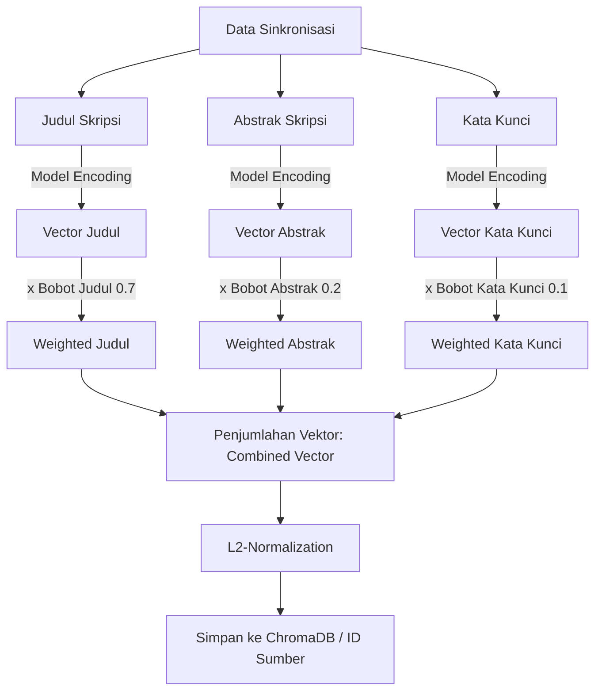

# Arsitektur & Detail Teknis Sistem (Skripsi Similarity API)

Dokumen ini menjelaskan rancangan arsitektur, integrasi data, alur kalkulasi representasi semantik (embedding), serta detail operasional sistem untuk kepentingan dokumentasi teknis atau penyusunan laporan kerja praktik.

---

## 1. Arsitektur Integrasi (Vector-Only Decoupled)

Sistem dirancang terpisah antara aplikasi bisnis utama (Laravel) dengan mesin pencari kemiripan berbasis vektor (FastAPI). 

```mermaid
graph LR
    subgraph Laravel (ruangbaca)
        DB[(MySQL)]
        Obs[Observer / Event]
        Ctrl[Similarity Controller]
    end

    subgraph FastAPI (similarity-api)
        App[FastAPI App]
        ML[Sentence Transformers]
        VDB[(ChromaDB)]
    end

    Obs -->|HTTP REST Sync| App
    Ctrl -->|HTTP REST Check| App
    App -->|Generate Vectors| ML
    App -->|Store & Query| VDB
    DB <---> Obs
```

### Prinsip Kerja Integration:
1. **Source of Truth**: Seluruh data utama skripsi (biodata mahasiswa, berkas PDF, transaksional) disimpan di database **MySQL** milik Laravel.
2. **Tanpa Cache Duplikat**: FastAPI tidak menyimpan salinan field teks skripsi secara mentah (raw text) dalam SQLite lokal. FastAPI hanya memetakan `id` skripsi dengan representasi vektor numeriknya (*embeddings*) di ChromaDB.
3. **Penyajian Data**: Ketika endpoint `/check` dipanggil, FastAPI hanya mengembalikan daftar `id` skripsi berserta skor kemiripannya. Laravel kemudian mengambil data detail skripsi (judul, nim, nama) dari database MySQL miliknya menggunakan query `WHERE IN (id)`.

---

## 2. Pipeline Pengolahan Data & Pembobotan Vektor

Kemiripan semantik tidak hanya dihitung berdasarkan judul, tetapi menggabungkan beberapa atribut skripsi yang dikirim dari Laravel (Judul, Abstrak, Kata Kunci) dengan bobot tertentu.



### Perhitungan Gabungan Vektor:
Representasi vektor akhir ($V_{\text{gabungan}}$) dihitung menggunakan rumus penjumlahan berbobot dari masing-masing embedding atribut:

$$V_{\text{gabungan}} = w_{\text{judul}} \cdot V_{\text{judul}} + w_{\text{abstrak}} \cdot V_{\text{abstrak}} + w_{\text{kata\_kunci}} \cdot V_{\text{kata\_kunci}}$$

*Konfigurasi Default Bobot:*
*   Bobot Judul ($w_{\text{judul}}$) = `0.7`
*   Bobot Abstrak ($w_{\text{abstrak}}$) = `0.2`
*   Bobot Kata Kunci ($w_{\text{kata\_kunci}}$) = `0.1`

### Normalisasi L2:
Gabungan vektor kemudian dinormalisasi menggunakan L2-norm agar panjang proyeksi vektor bernilai tepat 1 ($\|V_{\text{gabungan}}\|_2 = 1$). 
Keuntungan normalisasi ini adalah kalkulasi *Cosine Similarity* pada ChromaDB dapat disederhanakan menjadi operasi *Dot Product* langsung:

$$\text{Cosine Similarity}(Q, D) = Q \cdot D$$

---

## 3. Komponen Utama & Alur Kode

### A. Model Inference Engine (`app/services/embedding_service.py`)
Mesin ini memuat model NLP untuk mengubah teks string menjadi representasi numerik.
*   **Mode ONNX**: Jika pustaka `optimum` tersedia dan berkas model ONNX ditemukan di direktori cache lokal, FastAPI akan menggunakan ONNX Runtime untuk melakukan inferensi CPU yang jauh lebih hemat RAM dan cepat (menggunakan kuantisasi 8-bit).
*   **Mode Fallback**: Menggunakan SentenceTransformer standar berbasis PyTorch.
*   **Concurrency Control**: Dilengkapi dengan semaphore (`INFERENCE_CONCURRENCY`) untuk membatasi eksekusi model secara paralel demi mencegah kebocoran memori (OOM) pada server spesifikasi rendah.
*   **Caching**: Menyimpan cache embedding dari judul yang sering dicek (`LRUCache`) agar tidak perlu di-encode berulang kali.

### B. Router Similarity (`app/api/similarity.py`)
Menangani HTTP request pengecekan kemiripan.
*   **Endpoint `/check`**: Menerima input judul baru $\rightarrow$ memanggil encoder $\rightarrow$ mencari tetangga terdekat di ChromaDB $\rightarrow$ menyaring hasil di bawah ambang batas (*threshold*) $\rightarrow$ mengembalikan data daftar `id` dan skor.
*   **Endpoint `/compare`**: Membandingkan kemiripan langsung secara internal antara dua string teks tanpa mengakses database vektor (berguna untuk testing cepat).
*   **Endpoint `/stats`**: Membaca metadata yang disimpan di ChromaDB untuk menghitung agregasi sebaran skripsi per tahun akademik dan program studi secara cepat menggunakan `Counter` Python.

### C. Router Sinkronisasi (`app/api/sync.py`)
Menyediakan antarmuka komunikasi agar data di ChromaDB selalu sinkron dengan MySQL Laravel.
*   **Endpoint `/upsert`**: Dipanggil melalui Laravel Eloquent Observer setiap kali admin menambahkan atau menyunting data skripsi.
*   **Endpoint `/bulk-upsert`**: Digunakan untuk inisialisasi awal (*initial seeding*) saat memindahkan ribuan data skripsi lama dari Laravel ke ChromaDB secara asinkron menggunakan antrean tugas (*sync jobs*).
*   **Endpoint `/indexed-ids`**: Memungkinkan Laravel melakukan rekonsiliasi data dengan meminta semua ID yang telah sukses diindeks di ChromaDB.

---

## 4. Metrik Evaluasi Sistem (`scripts/evaluate.py`)

Untuk memvalidasi akurasi sistem deteksi kemiripan semantik, repositori ini menyediakan modul pengujian berbasis **Confusion Matrix**. Modul ini menguji dataset berisi pasangan judul mirip (sinonim/parafrase) dan pasangan judul yang tidak berhubungan dengan ambang batas (*threshold*) kemiripan $\ge 0.70$.

### Komponen Confusion Matrix:
1.  **True Positive (TP)**: Judul mirip dideteksi mirip oleh sistem.
2.  **True Negative (TN)**: Judul berbeda dideteksi tidak mirip oleh sistem.
3.  **False Positive (FP)**: Judul berbeda terdeteksi mirip oleh sistem.
4.  **False Negative (FN)**: Judul mirip terdeteksi tidak mirip oleh sistem.

### Metrik Akurasi:

$$\text{Precision} = \frac{\text{TP}}{\text{TP} + \text{FP}} \qquad \text{Recall} = \frac{\text{TP}}{\text{TP} + \text{FN}}$$

$$\text{F1-Score} = 2 \cdot \frac{\text{Precision} \cdot \text{Recall}}{\text{Precision} + \text{Recall}}$$

Untuk menjalankan evaluasi akurasi pada server, gunakan perintah:
```bash
python scripts/evaluate.py --token <SYNC_SECRET> --threshold 0.70
```
