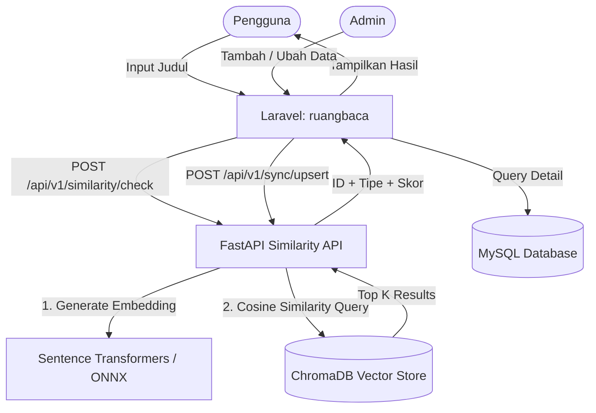

# RuangBaca Similarity API

Semantic similarity microservice untuk deteksi kemiripan dokumen akademik berbasis **FastAPI**, **Sentence Transformers**, dan **ChromaDB**.


---

## Arsitektur

Service ini menggunakan arsitektur **vector-only**:

- **Laravel** tetap menjadi *source of truth* — semua data skripsi dan laporan KP tersimpan di MySQL.
- **FastAPI** hanya menerima payload sinkronisasi, menghasilkan embedding, dan menyimpan vector.
- Hasil similarity hanya mengembalikan `document_id`, `document_type`, dan skor — detail data tetap diambil oleh Laravel.



**Stack:**
- Model embedding: `paraphrase-multilingual-MiniLM-L12-v2` (mendukung teks Bahasa Indonesia)
- Runtime: ONNX quantized (prioritas) → SentenceTransformer (fallback)
- Scoring: hybrid cosine semantic + Jaccard lexical
- Vector index: ChromaDB dengan HNSW cosine space

---

## Endpoint

### Meta

| Method | Path | Deskripsi |
|--------|------|-----------|
| `GET` | `/` | Informasi service dan versi |
| `GET` | `/health` | Status service, model, dan jumlah vector terindeks |

### Similarity

| Method | Path | Deskripsi |
|--------|------|-----------|
| `POST` | `/api/v1/similarity/check` | Cek kemiripan judul dengan seluruh indeks |
| `POST` | `/api/v1/similarity/compare` | Bandingkan dua judul secara langsung |
| `GET` | `/api/v1/similarity/stats` | Distribusi data per program studi dan tahun |

### Sync (dari Laravel)

Semua endpoint sync wajib menyertakan header:

```
Authorization: Bearer <SYNC_SECRET>
```

| Method | Path | Deskripsi |
|--------|------|-----------|
| `POST` | `/api/v1/sync/upsert` | Sinkronisasi satu dokumen |
| `POST` | `/api/v1/sync/bulk-upsert` | Sinkronisasi massal (async job) |
| `GET` | `/api/v1/sync/jobs/{job_id}` | Status bulk sync job |
| `DELETE` | `/api/v1/sync/{document_id}` | Hapus dokumen dari indeks |

---

## Payload

### Sync — Upsert

```json
{
  "document_id": "skripsi_123",
  "document_type": "skripsi",
  "judul": "Sistem Deteksi Kemiripan Judul Skripsi",
  "abstrak": "Abstrak opsional untuk meningkatkan akurasi embedding.",
  "kata_kunci": "nlp, similarity, sentence transformers",
  "tahun": 2024,
  "program_studi": "Informatika",
  "nim": "210170001",
  "nama_mahasiswa": "Nama Mahasiswa"
}
```

### Similarity Check — Request

```json
{
  "judul": "Sistem Deteksi Kemiripan Judul Skripsi",
  "top_k": 5,
  "threshold": 0.65,
  "document_type": "skripsi"
}
```

### Similarity Check — Response

```json
{
  "query": { "judul": "Sistem Deteksi Kemiripan Judul Skripsi" },
  "total_found": 2,
  "results": [
    {
      "id": "skripsi_123",
      "document_id": 123,
      "document_type": "skripsi",
      "similarity_score": 0.9211,
      "similarity_persen": "92.1%",
      "level": "SANGAT TINGGI"
    }
  ],
  "peringatan": "Ditemukan judul dengan kemiripan SANGAT TINGGI (92.1%). Pertimbangkan untuk merevisi."
}
```

**Level kemiripan:**

| Level | Skor | Keterangan |
|-------|------|------------|
| SANGAT TINGGI | ≥ 85% | Wajib revisi judul/topik |
| TINGGI | 70–84% | Pertimbangkan revisi |
| SEDANG | 50–69% | Perlu ditinjau |
| RENDAH | < 50% | Aman |

---

## Menjalankan Lokal

### Python

```bash
python -m venv .venv
.venv\Scripts\activate        # Windows
# source .venv/bin/activate   # Linux/macOS
pip install -r requirements.txt
copy .env.example .env        # lalu isi SYNC_SECRET
python main.py
```

API tersedia di `http://localhost:8181` — dokumentasi interaktif di `http://localhost:8181/docs`.

### Docker Compose

```bash
docker compose build
docker compose up -d
docker compose logs -f similarity-api
```

---

## Integrasi Laravel

Set environment di Laravel:

```env
SIMILARITY_API_URL=https://<username>-<space-name>.hf.space
SIMILARITY_API_SECRET=<nilai SYNC_SECRET yang sama>
```

Contoh Observer:

```php
class SkripsiObserver
{
    public function saved(Skripsi $skripsi): void
    {
        Http::withToken(config('services.similarity.secret'))
            ->post(config('services.similarity.url') . '/api/v1/sync/upsert', [
                'document_id'    => 'skripsi_' . $skripsi->id,
                'document_type'  => 'skripsi',
                'judul'          => $skripsi->judul,
                'abstrak'        => $skripsi->abstrak,
                'kata_kunci'     => $skripsi->kata_kunci,
                'tahun'          => $skripsi->tahun,
                'program_studi'  => $skripsi->program_studi,
                'nim'            => $skripsi->nim,
                'nama_mahasiswa' => $skripsi->nama_mahasiswa,
            ]);
    }

    public function deleted(Skripsi $skripsi): void
    {
        Http::withToken(config('services.similarity.secret'))
            ->delete(config('services.similarity.url') . '/api/v1/sync/skripsi_' . $skripsi->id);
    }
}
```

**Rekomendasi integrasi:**
- Gunakan `bulk-upsert` untuk initial sync
- Gunakan Observer untuk operasi create / update / delete setelahnya
- Business logic dan tampilan detail tetap dikelola di Laravel

---

## Reindex

Kirim ulang data dari file JSON yang diekspor dari Laravel:

```bash
python scripts/reindex.py --token <SYNC_SECRET> --input data-skripsi.json --batch-size 100
```

Dengan Docker:

```bash
docker compose exec similarity-api python scripts/reindex.py \
  --url http://localhost:7860 \
  --token <SYNC_SECRET> \
  --input /data/data-skripsi.json \
  --batch-size 100
```

Jalankan reindex saat:
- Model embedding berubah
- Migrasi server atau storage
- ChromaDB kosong atau perlu dibersihkan

---

## Evaluasi Model

Jalankan evaluasi akurasi menggunakan dataset pasangan judul ground-truth:

```bash
python scripts/evaluate.py --token <SYNC_SECRET> --threshold 0.65
```

Output (disimpan ke `results/`):
- `eval_<timestamp>.json` — metrik lengkap per threshold
- `eval_<timestamp>_threshold_sweep.csv` — sweep threshold 40–95%
- `eval_<timestamp>_predictions.csv` — detail prediksi per pasang judul

Visualisasikan hasilnya di Jupyter notebook:

```bash
jupyter notebook notebooks/evaluate.ipynb
```

---

## Testing

```bash
python -m pytest tests/ -v
```

**Coverage:**
- `tests/test_similarity_utils.py` — `calculate_jaccard`, `get_similarity_level`, `format_persen`
- `tests/test_embedding_service.py` — `clean_title`, `_resolve_weights`, `build_index_text`
- `tests/test_schemas.py` — validasi `SyncItem` dan `SimilarityCheckRequest`

---

## Keamanan

- `SYNC_SECRET` wajib minimal 16 karakter — aplikasi gagal start jika masih nilai default
- Verifikasi token menggunakan constant-time compare
- Container berjalan sebagai non-root user UID `1000`
- Model tidak diunduh saat runtime — dibundel ke dalam Docker image
