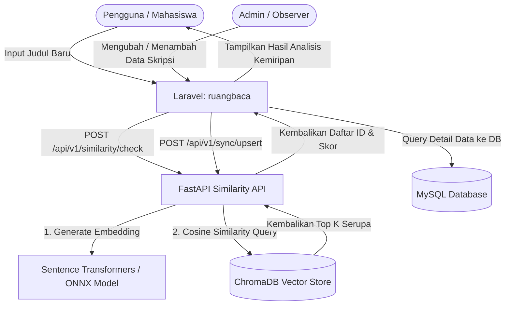

# Skripsi Similarity API

API deteksi kemiripan judul skripsi berbasis FastAPI, Sentence Transformers, dan ChromaDB.

Repo ini sekarang memakai arsitektur `vector_only`:

- Laravel/ruangbaca tetap menjadi source of truth data skripsi.
- FastAPI hanya menerima payload sinkronisasi, membuat embedding, dan menyimpan vector.
- Hasil similarity mengembalikan `id` sumber + skor, lalu detail data diambil lagi oleh Laravel.

---

## 📘 Pedoman Laporan Kerja Praktik / Skripsi

Repositori ini telah dilengkapi dengan panduan penulisan akademik untuk membantu penyusunan laporan Kerja Praktik (KP) atau Skripsi.

👉 **[PANDUAN_LAPORAN.md](./PANDUAN_LAPORAN.md)**: Berisi draf Bab I hingga Bab V, penjelasan teori model (Sentence Transformers, ONNX), rumus perhitungan pembobotan judul/abstrak, format tabel pengujian *Confusion Matrix*, dan cara menguji akurasi model.

### Peta Rujukan Komponen Repositori ke Laporan Akademik:

| Bagian Laporan | Topik Pembahasan | File / Komponen Rujukan Utama |
| :--- | :--- | :--- |
| **Bab II (Landasan Teori)** | NLP Embeddings & Kuantisasi ONNX | [app/services/embedding_service.py](./app/services/embedding_service.py) |
| **Bab III (Analisis & Desain)**| Arsitektur "Vector-Only" & Alur Data | Diagram Mermaid & [app/api/similarity.py](./app/api/similarity.py) |
| **Bab III (Analisis & Desain)**| Rumus Pembobotan Kombinasi Vektor | Metode `encode_for_index` di [app/services/embedding_service.py](./app/services/embedding_service.py) |
| **Bab IV (Implementasi)** | RESTful API Endpoints & FastAPI Router | [app/api/similarity.py](./app/api/similarity.py) & [app/api/sync.py](./app/api/sync.py) |
| **Bab IV (Pengujian)** | Evaluasi Akurasi, Precision & Recall | [scripts/evaluate.py](./scripts/evaluate.py) |
| **Bab IV (Pengujian)** | Agregasi Data & Statistik Distribusi | Endpoint `/stats` di [app/api/similarity.py](./app/api/similarity.py) |

---

## Ringkasan Arsitektur



- FastAPI melayani endpoint similarity dan sync.
- MySQL di Laravel menyimpan data skripsi utama.
- ChromaDB menyimpan embedding untuk semantic similarity.
- Model embedding lokal dibundel ke image dan dipakai dalam mode offline.
- Runtime memprioritaskan ONNX quantized agar inferensi CPU lebih ringan.

---

## Endpoint Utama

### Meta

- `GET /`
- `GET /health`

### Similarity

- `POST /api/v1/similarity/check` - Cek kemiripan judul skripsi
- `POST /api/v1/similarity/compare` - Bandingkan dua judul secara langsung (uji coba/offline)
- `GET /api/v1/similarity/stats` - Statistik agregasi metadata untuk visualisasi laporan

### Sync dari Laravel

Semua endpoint sync wajib header:

```text
Authorization: Bearer <SYNC_SECRET>
```

- `POST /api/v1/sync/upsert` - Sinkronisasi satu data skripsi (Observer)
- `POST /api/v1/sync/bulk-upsert` - Sinkronisasi massal asinkron (Artisan command)
- `GET /api/v1/sync/jobs/{job_id}` - Cek status bulk sync job
- `GET /api/v1/sync/indexed-ids` - Daftar ID skripsi yang sudah terindeks (rekonsiliasi)
- `DELETE /api/v1/sync/{skripsi_id}` - Hapus skripsi dari indeks


## Contoh Payload Sync

Payload baru yang direkomendasikan:

```json
{
  "skripsi_id": 123,
  "judul": "Sistem Deteksi Kemiripan Judul Skripsi",
  "abstrak": "Abstrak opsional",
  "kata_kunci": "nlp, similarity",
  "tahun": 2026,
  "program_studi": "Informatika",
  "nim": "210170001",
  "nama_mahasiswa": "Nama Mahasiswa"
}
```

Payload lama berikut masih diterima sementara:

```json
{
  "laravel_id": 123,
  "judul": "Sistem Deteksi Kemiripan Judul Skripsi"
}
```

## Bentuk Hasil Similarity

Contoh `POST /api/v1/similarity/check`:

```json
{
  "query": {
    "judul": "Sistem Deteksi Kemiripan Judul Skripsi"
  },
  "total_found": 2,
  "results": [
    {
      "id": 123,
      "similarity_score": 0.9211,
      "similarity_persen": "92.11%",
      "level": "SANGAT TINGGI"
    },
    {
      "id": 88,
      "similarity_score": 0.8734,
      "similarity_persen": "87.34%",
      "level": "TINGGI"
    }
  ]
}
```

Laravel lalu mengambil detail skripsi berdasarkan daftar `id` tersebut dari MySQL.

## Menjalankan Lokal

### Python langsung

```bash
python -m venv .venv
.venv\Scripts\activate
pip install -r requirements.txt
copy .env.example .env
python main.py
```

API lokal akan berjalan di:

- `http://localhost:8181`
- docs: `http://localhost:8181/docs`

### Docker Compose

```bash
docker compose build
docker compose up -d
docker compose logs -f similarity-api
```

Port host lokal:

- `http://localhost:8181`

Port internal container:

- `7860`

## Integrasi Laravel

Set environment di Laravel:

```env
SIMILARITY_API_URL=https://<username>-<space-name>.hf.space
SIMILARITY_API_SECRET=<nilai SYNC_SECRET yang sama>
```

Contoh observer Laravel:

```php
class SkripsiObserver
{
    public function saved(Skripsi $skripsi): void
    {
        Http::withToken(config('services.similarity.secret'))
            ->post(config('services.similarity.url') . '/api/v1/sync/upsert', [
                'skripsi_id'     => $skripsi->id,
                'judul'          => $skripsi->judul,
                'abstrak'        => $skripsi->abstrak,
                'kata_kunci'     => $skripsi->kata_kunci,
                'tahun'          => $skripsi->tahun,
                'program_studi'  => $skripsi->program_studi,
                'nim'            => $skripsi->nim,
                'nama_mahasiswa' => $skripsi->nama_mahasiswa,
            ]);
    }

    public function deleted(Skripsi $skripsi): void
    {
        Http::withToken(config('services.similarity.secret'))
            ->delete(config('services.similarity.url') . '/api/v1/sync/' . $skripsi->id);
    }
}
```

Rekomendasi integrasi:

- gunakan `bulk-upsert` untuk initial sync
- gunakan observer untuk create, update, delete setelah initial sync
- setelah `check` mengembalikan daftar `id`, detail dan business rule tetap diambil di Laravel

## Reindex

Karena service ini tidak lagi menyimpan salinan data skripsi lokal, reindex dilakukan dengan mengirim ulang export JSON dari aplikasi utama:

```bash
python scripts/reindex.py --token <SYNC_SECRET> --input data-skripsi.json --batch-size 100
```

Jika API berjalan di Docker:

```bash
docker compose exec similarity-api python scripts/reindex.py --url http://localhost:7860 --token <SYNC_SECRET> --input /data/data-skripsi.json --batch-size 100
```

Gunakan reindex saat:

- model embedding berubah
- metadata vector store lama perlu dirapikan
- migrasi server atau storage
- ChromaDB kosong atau rusak

## Pengujian & Evaluasi Akurasi

Untuk mempermudah penulisan Bab Pengujian di Laporan Skripsi, jalankan script evaluasi berikut untuk menguji akurasi model secara otomatis menggunakan Confusion Matrix (Precision, Recall, F1-Score):

```bash
python scripts/evaluate.py --token <SYNC_SECRET> --threshold 0.70
```

## Keamanan

- `SYNC_SECRET` wajib minimal 16 karakter dan sebaiknya acak panjang
- verifikasi token sync memakai constant-time compare
- container berjalan sebagai user non-root UID `1000`
- model tidak di-download saat runtime

## Catatan Migrasi

- tabel SQLite lama yang sebelumnya menyimpan cache data skripsi tidak lagi dipakai oleh aplikasi
- metadata vector store lama yang masih menyimpan field tambahan tetap bisa terbaca
- untuk merapikan metadata vector store agar mendapat metadata `program_studi` dan `tahun` secara bersih untuk endpoint `/stats`, jalankan reindex sekali setelah deploy versi ini
